# 1

--

## Shift s2

    inputs 1 $
    status 0
    results 
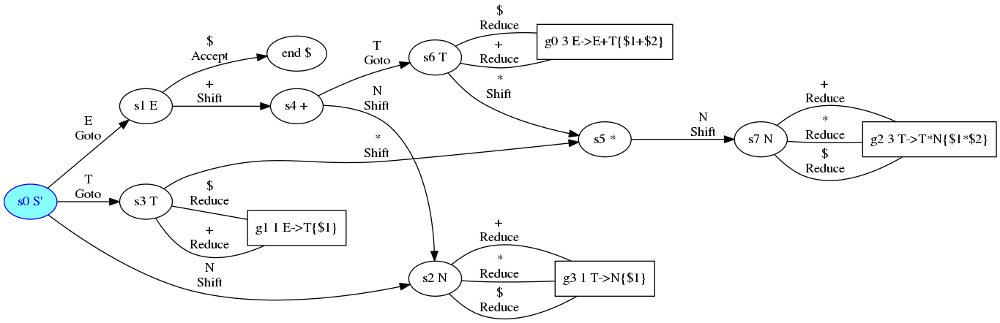

--

## Shift s2

    inputs 1 $
    status 0
    results 

--

## Reduce g3

    inputs $
    status 2 0
    results 1

--

## Reduce g3

    inputs $
    status 2 0
    results 1
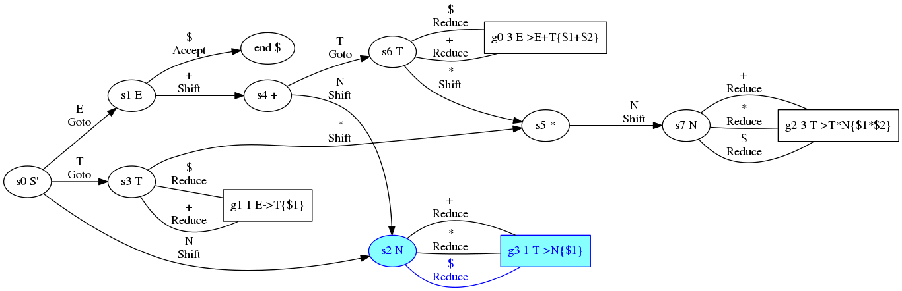

--

## Goto s3

    inputs T $
    status 0
    results 1

--

## Goto s3

    inputs T $
    status 0
    results 1

--

## Reduce g1

    inputs $
    status 3 0
    results 1
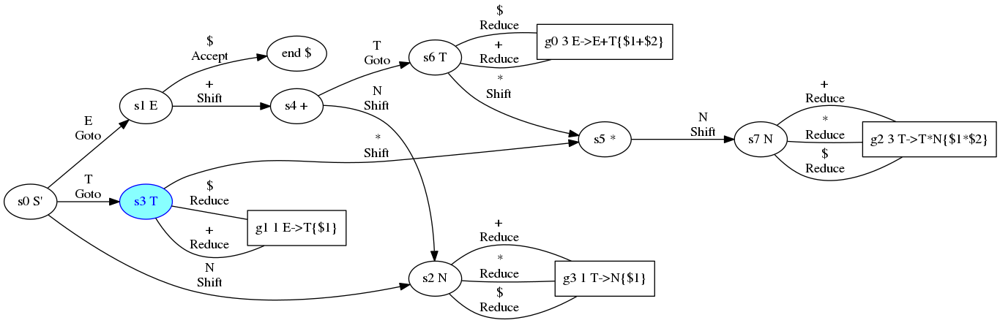

--

## Reduce g1

    inputs $
    status 3 0
    results 1

--

## Goto s1

    inputs E $
    status 0
    results 1

--

## Goto s1

    inputs E $
    status 0
    results 1

--

## Accept

    inputs $
    status 1 0
    results 1
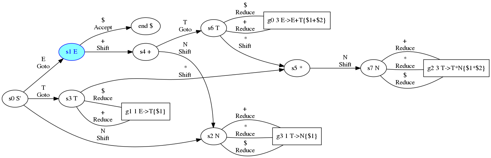

--

## Accept

    inputs $
    status 1 0
    results 1
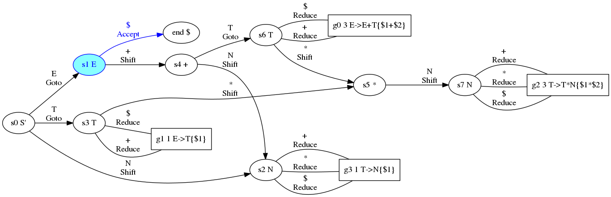

--

## Accept

    inputs $
    status 1 0
    results 1
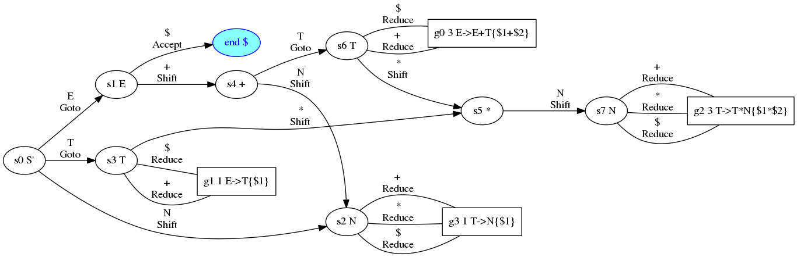

--

# result 1 = 1

---

# 2\*3

--

## Shift s2

    inputs 2 * 3 $
    status 0
    results 

--

## Shift s2

    inputs 2 * 3 $
    status 0
    results 

--

## Reduce g3

    inputs * 3 $
    status 2 0
    results 2

--

## Reduce g3

    inputs * 3 $
    status 2 0
    results 2
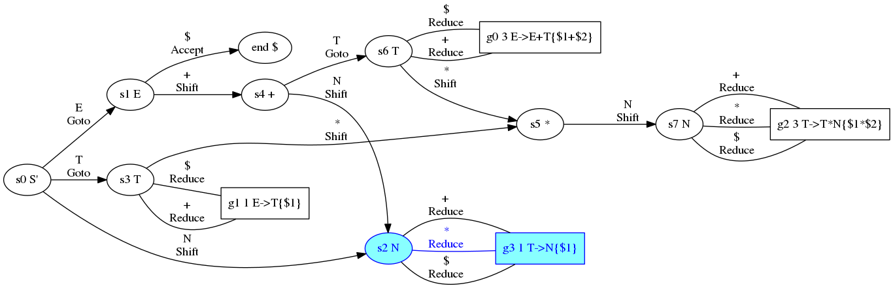

--

## Goto s3

    inputs T * 3 $
    status 0
    results 2

--

## Goto s3

    inputs T * 3 $
    status 0
    results 2

--

## Shift s5

    inputs * 3 $
    status 3 0
    results 2

--

## Shift s5

    inputs * 3 $
    status 3 0
    results 2

--

## Shift s7

    inputs 3 $
    status 5 3 0
    results * 2

--

## Shift s7

    inputs 3 $
    status 5 3 0
    results * 2

--

## Reduce g2

    inputs $
    status 7 5 3 0
    results 3 * 2

--

## Reduce g2

    inputs $
    status 7 5 3 0
    results 3 * 2

--

## Goto s3

    inputs T $
    status 0
    results 6

--

## Goto s3

    inputs T $
    status 0
    results 6

--

## Reduce g1

    inputs $
    status 3 0
    results 6

--

## Reduce g1

    inputs $
    status 3 0
    results 6

--

## Goto s1

    inputs E $
    status 0
    results 6

--

## Goto s1

    inputs E $
    status 0
    results 6

--

## Accept

    inputs $
    status 1 0
    results 6

--

## Accept

    inputs $
    status 1 0
    results 6

--

## Accept

    inputs $
    status 1 0
    results 6

--

# result 2\*3 = 6

---

# 2\*3\*4

--

## Shift s2

    inputs 2 * 3 * 4 $
    status 0
    results 

--

## Shift s2

    inputs 2 * 3 * 4 $
    status 0
    results 

--

## Reduce g3

    inputs * 3 * 4 $
    status 2 0
    results 2

--

## Reduce g3

    inputs * 3 * 4 $
    status 2 0
    results 2

--

## Goto s3

    inputs T * 3 * 4 $
    status 0
    results 2

--

## Goto s3

    inputs T * 3 * 4 $
    status 0
    results 2

--

## Shift s5

    inputs * 3 * 4 $
    status 3 0
    results 2

--

## Shift s5

    inputs * 3 * 4 $
    status 3 0
    results 2

--

## Shift s7

    inputs 3 * 4 $
    status 5 3 0
    results * 2

--

## Shift s7

    inputs 3 * 4 $
    status 5 3 0
    results * 2

--

## Reduce g2

    inputs * 4 $
    status 7 5 3 0
    results 3 * 2

--

## Reduce g2

    inputs * 4 $
    status 7 5 3 0
    results 3 * 2

--

## Goto s3

    inputs T * 4 $
    status 0
    results 6

--

## Goto s3

    inputs T * 4 $
    status 0
    results 6

--

## Shift s5

    inputs * 4 $
    status 3 0
    results 6

--

## Shift s5

    inputs * 4 $
    status 3 0
    results 6

--

## Shift s7

    inputs 4 $
    status 5 3 0
    results * 6

--

## Shift s7

    inputs 4 $
    status 5 3 0
    results * 6

--

## Reduce g2

    inputs $
    status 7 5 3 0
    results 4 * 6

--

## Reduce g2

    inputs $
    status 7 5 3 0
    results 4 * 6

--

## Goto s3

    inputs T $
    status 0
    results 24

--

## Goto s3

    inputs T $
    status 0
    results 24

--

## Reduce g1

    inputs $
    status 3 0
    results 24

--

## Reduce g1

    inputs $
    status 3 0
    results 24

--

## Goto s1

    inputs E $
    status 0
    results 24

--

## Goto s1

    inputs E $
    status 0
    results 24

--

## Accept

    inputs $
    status 1 0
    results 24

--

## Accept

    inputs $
    status 1 0
    results 24

--

## Accept

    inputs $
    status 1 0
    results 24

--

# result 2\*3\*4 = 24

---

# 1\+2

--

## Shift s2

    inputs 1 + 2 $
    status 0
    results 

--

## Shift s2

    inputs 1 + 2 $
    status 0
    results 

--

## Reduce g3

    inputs + 2 $
    status 2 0
    results 1

--

## Reduce g3

    inputs + 2 $
    status 2 0
    results 1
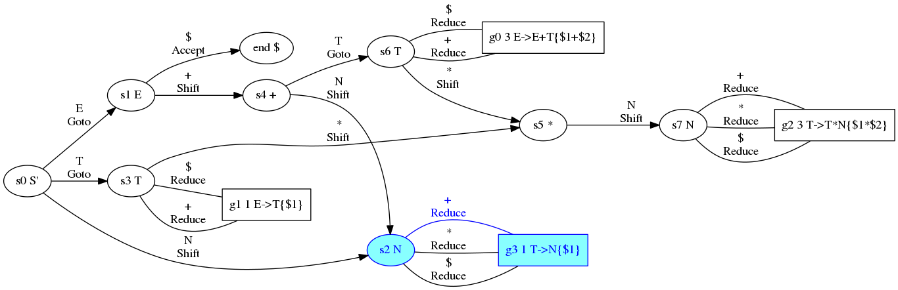

--

## Goto s3

    inputs T + 2 $
    status 0
    results 1

--

## Goto s3

    inputs T + 2 $
    status 0
    results 1

--

## Reduce g1

    inputs + 2 $
    status 3 0
    results 1

--

## Reduce g1

    inputs + 2 $
    status 3 0
    results 1
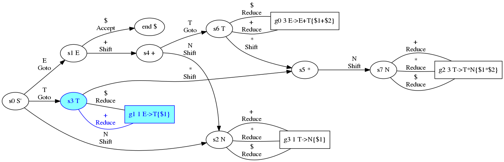

--

## Goto s1

    inputs E + 2 $
    status 0
    results 1

--

## Goto s1

    inputs E + 2 $
    status 0
    results 1

--

## Shift s4

    inputs + 2 $
    status 1 0
    results 1

--

## Shift s4

    inputs + 2 $
    status 1 0
    results 1

--

## Shift s2

    inputs 2 $
    status 4 1 0
    results + 1

--

## Shift s2

    inputs 2 $
    status 4 1 0
    results + 1
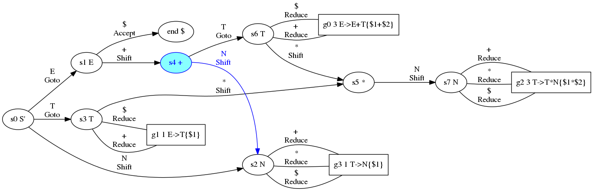

--

## Reduce g3

    inputs $
    status 2 4 1 0
    results 2 + 1

--

## Reduce g3

    inputs $
    status 2 4 1 0
    results 2 + 1

--

## Goto s6

    inputs T $
    status 4 1 0
    results 2 + 1

--

## Goto s6

    inputs T $
    status 4 1 0
    results 2 + 1
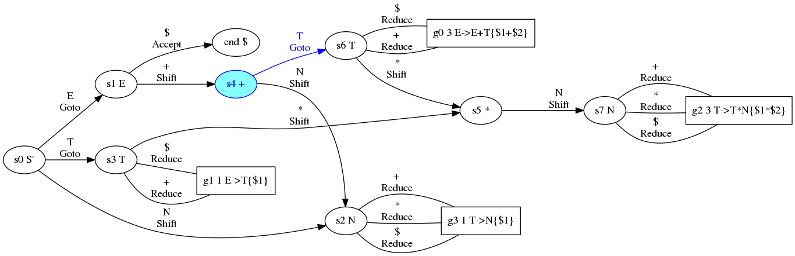

--

## Reduce g0

    inputs $
    status 6 4 1 0
    results 2 + 1

--

## Reduce g0

    inputs $
    status 6 4 1 0
    results 2 + 1

--

## Goto s1

    inputs E $
    status 0
    results 3

--

## Goto s1

    inputs E $
    status 0
    results 3

--

## Accept

    inputs $
    status 1 0
    results 3

--

## Accept

    inputs $
    status 1 0
    results 3

--

## Accept

    inputs $
    status 1 0
    results 3

--

# result 1\+2 = 3

---

# 1\+2\+3

--

## Shift s2

    inputs 1 + 2 + 3 $
    status 0
    results 

--

## Shift s2

    inputs 1 + 2 + 3 $
    status 0
    results 

--

## Reduce g3

    inputs + 2 + 3 $
    status 2 0
    results 1

--

## Reduce g3

    inputs + 2 + 3 $
    status 2 0
    results 1

--

## Goto s3

    inputs T + 2 + 3 $
    status 0
    results 1

--

## Goto s3

    inputs T + 2 + 3 $
    status 0
    results 1

--

## Reduce g1

    inputs + 2 + 3 $
    status 3 0
    results 1

--

## Reduce g1

    inputs + 2 + 3 $
    status 3 0
    results 1

--

## Goto s1

    inputs E + 2 + 3 $
    status 0
    results 1

--

## Goto s1

    inputs E + 2 + 3 $
    status 0
    results 1

--

## Shift s4

    inputs + 2 + 3 $
    status 1 0
    results 1

--

## Shift s4

    inputs + 2 + 3 $
    status 1 0
    results 1

--

## Shift s2

    inputs 2 + 3 $
    status 4 1 0
    results + 1

--

## Shift s2

    inputs 2 + 3 $
    status 4 1 0
    results + 1

--

## Reduce g3

    inputs + 3 $
    status 2 4 1 0
    results 2 + 1

--

## Reduce g3

    inputs + 3 $
    status 2 4 1 0
    results 2 + 1

--

## Goto s6

    inputs T + 3 $
    status 4 1 0
    results 2 + 1

--

## Goto s6

    inputs T + 3 $
    status 4 1 0
    results 2 + 1

--

## Reduce g0

    inputs + 3 $
    status 6 4 1 0
    results 2 + 1

--

## Reduce g0

    inputs + 3 $
    status 6 4 1 0
    results 2 + 1

--

## Goto s1

    inputs E + 3 $
    status 0
    results 3

--

## Goto s1

    inputs E + 3 $
    status 0
    results 3

--

## Shift s4

    inputs + 3 $
    status 1 0
    results 3

--

## Shift s4

    inputs + 3 $
    status 1 0
    results 3

--

## Shift s2

    inputs 3 $
    status 4 1 0
    results + 3

--

## Shift s2

    inputs 3 $
    status 4 1 0
    results + 3

--

## Reduce g3

    inputs $
    status 2 4 1 0
    results 3 + 3

--

## Reduce g3

    inputs $
    status 2 4 1 0
    results 3 + 3

--

## Goto s6

    inputs T $
    status 4 1 0
    results 3 + 3

--

## Goto s6

    inputs T $
    status 4 1 0
    results 3 + 3

--

## Reduce g0

    inputs $
    status 6 4 1 0
    results 3 + 3

--

## Reduce g0

    inputs $
    status 6 4 1 0
    results 3 + 3

--

## Goto s1

    inputs E $
    status 0
    results 6

--

## Goto s1

    inputs E $
    status 0
    results 6

--

## Accept

    inputs $
    status 1 0
    results 6

--

## Accept

    inputs $
    status 1 0
    results 6

--

## Accept

    inputs $
    status 1 0
    results 6

--

# result 1\+2\+3 = 6

---

# 1\+2\*3

--

## Shift s2

    inputs 1 + 2 * 3 $
    status 0
    results 

--

## Shift s2

    inputs 1 + 2 * 3 $
    status 0
    results 

--

## Reduce g3

    inputs + 2 * 3 $
    status 2 0
    results 1

--

## Reduce g3

    inputs + 2 * 3 $
    status 2 0
    results 1

--

## Goto s3

    inputs T + 2 * 3 $
    status 0
    results 1

--

## Goto s3

    inputs T + 2 * 3 $
    status 0
    results 1

--

## Reduce g1

    inputs + 2 * 3 $
    status 3 0
    results 1

--

## Reduce g1

    inputs + 2 * 3 $
    status 3 0
    results 1

--

## Goto s1

    inputs E + 2 * 3 $
    status 0
    results 1

--

## Goto s1

    inputs E + 2 * 3 $
    status 0
    results 1

--

## Shift s4

    inputs + 2 * 3 $
    status 1 0
    results 1

--

## Shift s4

    inputs + 2 * 3 $
    status 1 0
    results 1

--

## Shift s2

    inputs 2 * 3 $
    status 4 1 0
    results + 1

--

## Shift s2

    inputs 2 * 3 $
    status 4 1 0
    results + 1

--

## Reduce g3

    inputs * 3 $
    status 2 4 1 0
    results 2 + 1

--

## Reduce g3

    inputs * 3 $
    status 2 4 1 0
    results 2 + 1

--

## Goto s6

    inputs T * 3 $
    status 4 1 0
    results 2 + 1

--

## Goto s6

    inputs T * 3 $
    status 4 1 0
    results 2 + 1

--

## Shift s5

    inputs * 3 $
    status 6 4 1 0
    results 2 + 1

--

## Shift s5

    inputs * 3 $
    status 6 4 1 0
    results 2 + 1

--

## Shift s7

    inputs 3 $
    status 5 6 4 1 0
    results * 2 + 1

--

## Shift s7

    inputs 3 $
    status 5 6 4 1 0
    results * 2 + 1

--

## Reduce g2

    inputs $
    status 7 5 6 4 1 0
    results 3 * 2 + 1

--

## Reduce g2

    inputs $
    status 7 5 6 4 1 0
    results 3 * 2 + 1

--

## Goto s6

    inputs T $
    status 4 1 0
    results 6 + 1

--

## Goto s6

    inputs T $
    status 4 1 0
    results 6 + 1

--

## Reduce g0

    inputs $
    status 6 4 1 0
    results 6 + 1

--

## Reduce g0

    inputs $
    status 6 4 1 0
    results 6 + 1

--

## Goto s1

    inputs E $
    status 0
    results 7

--

## Goto s1

    inputs E $
    status 0
    results 7

--

## Accept

    inputs $
    status 1 0
    results 7

--

## Accept

    inputs $
    status 1 0
    results 7

--

## Accept

    inputs $
    status 1 0
    results 7

--

# result 1\+2\*3 = 7

---

# 2\*3\+4

--

## Shift s2

    inputs 2 * 3 + 4 $
    status 0
    results 

--

## Shift s2

    inputs 2 * 3 + 4 $
    status 0
    results 

--

## Reduce g3

    inputs * 3 + 4 $
    status 2 0
    results 2

--

## Reduce g3

    inputs * 3 + 4 $
    status 2 0
    results 2

--

## Goto s3

    inputs T * 3 + 4 $
    status 0
    results 2

--

## Goto s3

    inputs T * 3 + 4 $
    status 0
    results 2

--

## Shift s5

    inputs * 3 + 4 $
    status 3 0
    results 2

--

## Shift s5

    inputs * 3 + 4 $
    status 3 0
    results 2

--

## Shift s7

    inputs 3 + 4 $
    status 5 3 0
    results * 2

--

## Shift s7

    inputs 3 + 4 $
    status 5 3 0
    results * 2

--

## Reduce g2

    inputs + 4 $
    status 7 5 3 0
    results 3 * 2

--

## Reduce g2

    inputs + 4 $
    status 7 5 3 0
    results 3 * 2
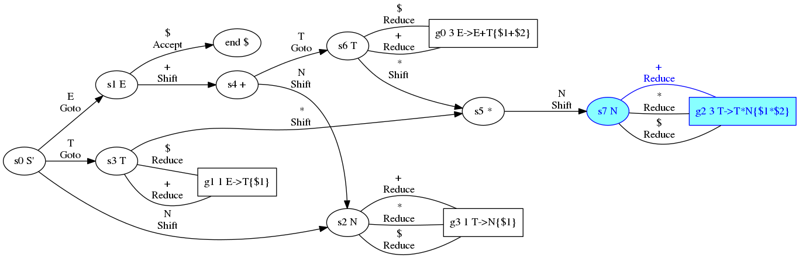

--

## Goto s3

    inputs T + 4 $
    status 0
    results 6

--

## Goto s3

    inputs T + 4 $
    status 0
    results 6

--

## Reduce g1

    inputs + 4 $
    status 3 0
    results 6

--

## Reduce g1

    inputs + 4 $
    status 3 0
    results 6

--

## Goto s1

    inputs E + 4 $
    status 0
    results 6

--

## Goto s1

    inputs E + 4 $
    status 0
    results 6

--

## Shift s4

    inputs + 4 $
    status 1 0
    results 6

--

## Shift s4

    inputs + 4 $
    status 1 0
    results 6

--

## Shift s2

    inputs 4 $
    status 4 1 0
    results + 6

--

## Shift s2

    inputs 4 $
    status 4 1 0
    results + 6

--

## Reduce g3

    inputs $
    status 2 4 1 0
    results 4 + 6

--

## Reduce g3

    inputs $
    status 2 4 1 0
    results 4 + 6

--

## Goto s6

    inputs T $
    status 4 1 0
    results 4 + 6

--

## Goto s6

    inputs T $
    status 4 1 0
    results 4 + 6

--

## Reduce g0

    inputs $
    status 6 4 1 0
    results 4 + 6

--

## Reduce g0

    inputs $
    status 6 4 1 0
    results 4 + 6

--

## Goto s1

    inputs E $
    status 0
    results 10

--

## Goto s1

    inputs E $
    status 0
    results 10

--

## Accept

    inputs $
    status 1 0
    results 10

--

## Accept

    inputs $
    status 1 0
    results 10

--

## Accept

    inputs $
    status 1 0
    results 10

--

# result 2\*3\+4 = 10

---

