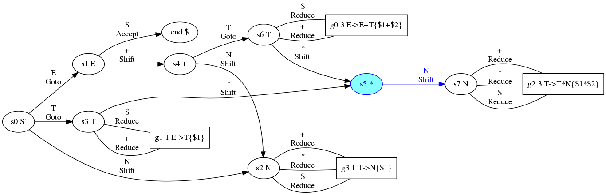
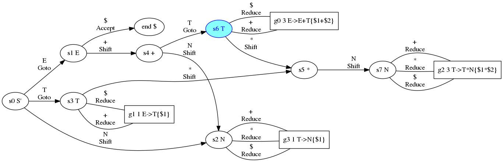
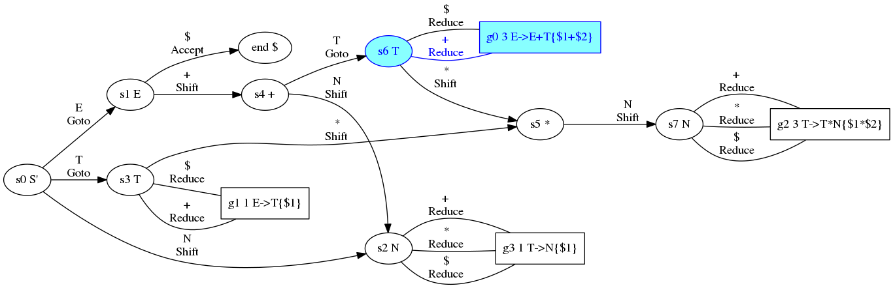
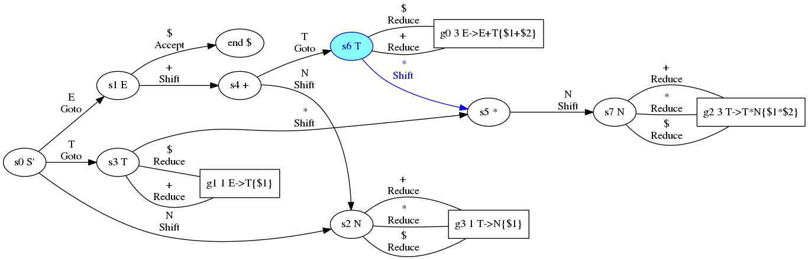

# プログラムを見て理解するLR構文解析

h_sakurai

---

### 要約

- LR構文解析は理解するのが難しいアルゴリズムです。
- しかしながら、動く短いソースがあれば理解の助けになるはずです。
- そこで、50行弱の小さなLR構文解析のプログラムを読みます。
- その後、構文解析表から状態遷移図生成するプログラムを作ります。
- さらに、パーサにログ機能を付けて(160行強)動きを見ます。

---

### 1. とにかくソースを見るぞゴルァ

プログラムは大きく5つに別れます:

1. 文法定義
    - 字句定義の lex
    - 構文定義の grammar
2. 構文解析表 table
3. 字句解析器 lexer
4. 構文解析器 parser
5. メイン処理

---

### 1.1. 文法定義

```
(* usage : ocaml -w -8-40 str.cma parse.ml *)
type i = I of int | E
let lex =   [ "ws", "[ \\r\\n\\t]+", (fun i->E);
              "N",  "[1-9][0-9]*",   (fun i-> I(int_of_string i));
              "+",  "+",             (fun i->E);
              "*",  "*",             (fun i->E);                   ]
let grammar=[|"E",["E";"+";"T"],(fun[I a;_;I b]->I(a+b));(*s0*)
              "E",["T"],        (fun[a]    ->a);         (*s1*)
              "T",["T";"*";"N"],(fun[I a;_;I b]->I(a*b));(*s2*)
              "T",["N"],        (fun[a]    ->a);         (*s3*)|]
```

- type i はスタック内に異なるデータを含めるためのデータです。
- 字句の定義と、文法の定義をコールバック付きで定義できます。

---

### 1.2. 構文解析表

```
type op = Accept | Shift of int | Reduce of int | Goto of int
let table = [|
(*0*)["N",Shift 2;                                     "E",Goto 1;"T",Goto 3];
(*1*)[           "+",Shift  4;             "$",Accept                       ];
(*2*)[           "+",Reduce 3;"*",Reduce 3;"$",Reduce 3                     ];
(*3*)[           "+",Reduce 1;"*",Shift  5;"$",Reduce 1                     ];
(*4*)["N",Shift 2;                                                "T",Goto 6];
(*5*)["N",Shift 7                                                           ];
(*6*)[           "+",Reduce 0;"*",Shift  5;"$",Reduce 0                     ];
(*7*)[           "+",Reduce 2;"*",Reduce 2;"$",Reduce 2                     ]|]
```

- LR構文解析には構文解析表が別途必要になります。
- 通常構文解析表はYaccなどのコンパイラコンパイラで自動生成します。
- 今回は、自前で用意しました。
- op は構文解析器の命令、完了、シフト、還元、Gotoをそれぞれ表します。

---

### 1.3. 字句解析器

```
let rec lexer = function "" -> ["$",E] | input ->
  let rule,_,callback = List.find(fun(_,p,f)->
    Str.string_match(Str.regexp p) input 0
  ) lex in
  match Str.string_after input (Str.match_end()),rule with
  | next,"ws" -> lexer next
  | next,rule -> (rule, callback (Str.matched_string input))::lexer next

let rec pop = function | 0,acc,s -> acc,s | n,acc,a::s -> pop (n-1,a::acc,s)
```

- 字句解析器は文字列を受け取り、字句リストを返します
- 文字列を受け取ってlexにstring_matchでマッチするものを見つけます
- match_endでマッチ文字列以降を取り出し
- ルール名が"ws"なら空白なので飛ばして再帰呼び出し
- それ以外はmatched_stringでマッチ文字列を取得後コールバック関数を読んでリストに加えます。
- pop はリストをn番目で分割し手前と後ろのリストのペアを返します

---

### 1.4. 構文解析器

```
let rec parser((t,v)::inputs,s::status,results) =
  match List.assoc t table.(s),(t,v)::inputs,s::status,results with
  | Accept  ,            _,status,r::_   -> r
  | Shift  s,(_,v)::inputs,status,results-> parser(inputs,s::status,v::results)
  | Goto   s,(_,_)::inputs,status,results-> parser(inputs,s::status,   results)
  | Reduce g,       inputs,status,results->
    let t,args,callback = grammar.(g) in let len = List.length args in
    let _,status = pop(len,[],status) in let rs,results=pop(len,[],results) in
    parser((t,E)::inputs,status,callback rs::results)
```

- parserは入力リスト、状態スタック、結果スタックを受け取り、構文解析表から命令を取り出して実行します。ReduceとGotoはペアの命令です。
- Accept は解析完了を意味し、結果スタックから値を返します。
- Shift は入力を結果スタックに積み引数Sを状態スタックに積みます。
- GotoはReduceの次に現れ入力を捨てて引数sを状態スタックに積みます。
- Reduce は引数gの文法を取得しパターン長分Pop、コールバック結果を結果に積み、次の命令Gotoを呼ぶために文法名を入力にpush backします。

---

### 1.5. メインプログラム

```
let parse input = parser(lexer input,[0],[])
let show = function
  | I i -> Printf.sprintf "%d" i
  | E -> Printf.sprintf "error"
let _ = assert(parse"1+2"=I 3); assert(parse"1+2*3"=I 7);
        assert(parse"2*3+4"=I 10); assert(parse "1 + 2*3 + 4"=I 11);
        Printf.printf "%s\n" (show (parse "1 + 2*3 + 4"))
```

- parse は文字列を受け取ってparserに文法、構文解析表、字句解析結果と初期のステータススタック、結果スタックを渡して呼び出す関数です。
- 使い方は `assert(parse"2*3+4"=I 10);` のように使います。
- showは結果の印字処理で、最終行では結果を印字しています。

---

### 1.6 まとめ

- LR構文解析のプログラムを見てみました。
- 文法定義は字句定義の lex、構文定義の grammarがあり LR構文解析では構文解析表 table が必要なので自前で用意しました。
- 字句解析器 lexer と 構文解析器 parser は短く定義できました。
- メイン処理では様々な入力に対してテストし、結果を表示してみました。
- LR構文解析のプログラム自体はとても簡単に書けました。

---

### LR構文解析

- LR構文解析は上昇型の表を使って構文解析する手法です
- 仕組み自体はいまはわかりませんが、表さえあれば構文解析プログラム自体は簡単に記述できます

---

### 2. 考察

---


### 2.1. 状態遷移図


- granphvizで 図を書きました。
- `1`,`1*2`,`1*2*3`,`1+1`,`1+1+1`,`1*2+1`,`1+2*3` の動きを考えてみるとよいはずです。
- Shift は移動し、Reduce文法を見て戻り、Gotoは文法で移動します。
- これを肴にすごろくゲームなどをしながらお酒を一杯飲めそうです。
- しかしながら、それでは説明になっていません。

---

### 2.2. 状態遷移図の自動生成


- 先程の図は自分で手書きしたa.dotファイルをdotプログラムに渡して生成していました。
- 理解を深めるために、自動的に生成するプログラムを作ってみました。

---

### 2.3. ロギング機能

- 遷移図はなかなか良いもののように思えたので、構文解析プログラムを改造しロギング機能を付けてプレゼン資料を作ってみました。

---

### 3. ログからLR構文解析の動きの説明

LR構文解析の動きをログを元に見てみます。

---

# 1

--

## Shift s2

    inputs 1 $
    status 0
    results 


--

## Shift s2

    inputs 1 $
    status 0
    results 


--

## Reduce g3

    inputs $
    status 2 0
    results 1


--

## Reduce g3

    inputs $
    status 2 0
    results 1


--

## Goto s3

    inputs T $
    status 0
    results 1


--

## Goto s3

    inputs T $
    status 0
    results 1


--

## Reduce g1

    inputs $
    status 3 0
    results 1


--

## Reduce g1

    inputs $
    status 3 0
    results 1


--

## Goto s1

    inputs E $
    status 0
    results 1


--

## Goto s1

    inputs E $
    status 0
    results 1


--

## Accept

    inputs $
    status 1 0
    results 1


--

## Accept

    inputs $
    status 1 0
    results 1


--

## Accept

    inputs $
    status 1 0
    results 1


--

# result 1 = 1

---

# 2\*3

--

## Shift s2

    inputs 2 * 3 $
    status 0
    results 


--

## Shift s2

    inputs 2 * 3 $
    status 0
    results 


--

## Reduce g3

    inputs * 3 $
    status 2 0
    results 2


--

## Reduce g3

    inputs * 3 $
    status 2 0
    results 2


--

## Goto s3

    inputs T * 3 $
    status 0
    results 2


--

## Goto s3

    inputs T * 3 $
    status 0
    results 2


--

## Shift s5

    inputs * 3 $
    status 3 0
    results 2


--

## Shift s5

    inputs * 3 $
    status 3 0
    results 2


--

## Shift s7

    inputs 3 $
    status 5 3 0
    results * 2


--

## Shift s7

    inputs 3 $
    status 5 3 0
    results * 2



--

## Reduce g2

    inputs $
    status 7 5 3 0
    results 3 * 2


--

## Reduce g2

    inputs $
    status 7 5 3 0
    results 3 * 2


--

## Goto s3

    inputs T $
    status 0
    results 6


--

## Goto s3

    inputs T $
    status 0
    results 6


--

## Reduce g1

    inputs $
    status 3 0
    results 6


--

## Reduce g1

    inputs $
    status 3 0
    results 6


--

## Goto s1

    inputs E $
    status 0
    results 6


--

## Goto s1

    inputs E $
    status 0
    results 6


--

## Accept

    inputs $
    status 1 0
    results 6


--

## Accept

    inputs $
    status 1 0
    results 6


--

## Accept

    inputs $
    status 1 0
    results 6


--

# result 2\*3 = 6

---

# 2\*3\*4

--

## Shift s2

    inputs 2 * 3 * 4 $
    status 0
    results 


--

## Shift s2

    inputs 2 * 3 * 4 $
    status 0
    results 


--

## Reduce g3

    inputs * 3 * 4 $
    status 2 0
    results 2


--

## Reduce g3

    inputs * 3 * 4 $
    status 2 0
    results 2


--

## Goto s3

    inputs T * 3 * 4 $
    status 0
    results 2


--

## Goto s3

    inputs T * 3 * 4 $
    status 0
    results 2


--

## Shift s5

    inputs * 3 * 4 $
    status 3 0
    results 2


--

## Shift s5

    inputs * 3 * 4 $
    status 3 0
    results 2


--

## Shift s7

    inputs 3 * 4 $
    status 5 3 0
    results * 2


--

## Shift s7

    inputs 3 * 4 $
    status 5 3 0
    results * 2


--

## Reduce g2

    inputs * 4 $
    status 7 5 3 0
    results 3 * 2


--

## Reduce g2

    inputs * 4 $
    status 7 5 3 0
    results 3 * 2


--

## Goto s3

    inputs T * 4 $
    status 0
    results 6


--

## Goto s3

    inputs T * 4 $
    status 0
    results 6


--

## Shift s5

    inputs * 4 $
    status 3 0
    results 6


--

## Shift s5

    inputs * 4 $
    status 3 0
    results 6


--

## Shift s7

    inputs 4 $
    status 5 3 0
    results * 6


--

## Shift s7

    inputs 4 $
    status 5 3 0
    results * 6


--

## Reduce g2

    inputs $
    status 7 5 3 0
    results 4 * 6


--

## Reduce g2

    inputs $
    status 7 5 3 0
    results 4 * 6


--

## Goto s3

    inputs T $
    status 0
    results 24


--

## Goto s3

    inputs T $
    status 0
    results 24


--

## Reduce g1

    inputs $
    status 3 0
    results 24


--

## Reduce g1

    inputs $
    status 3 0
    results 24


--

## Goto s1

    inputs E $
    status 0
    results 24


--

## Goto s1

    inputs E $
    status 0
    results 24


--

## Accept

    inputs $
    status 1 0
    results 24


--

## Accept

    inputs $
    status 1 0
    results 24


--

## Accept

    inputs $
    status 1 0
    results 24


--

# result 2\*3\*4 = 24

---

# 1\+2

--

## Shift s2

    inputs 1 + 2 $
    status 0
    results 


--

## Shift s2

    inputs 1 + 2 $
    status 0
    results 


--

## Reduce g3

    inputs + 2 $
    status 2 0
    results 1


--

## Reduce g3

    inputs + 2 $
    status 2 0
    results 1


--

## Goto s3

    inputs T + 2 $
    status 0
    results 1


--

## Goto s3

    inputs T + 2 $
    status 0
    results 1


--

## Reduce g1

    inputs + 2 $
    status 3 0
    results 1


--

## Reduce g1

    inputs + 2 $
    status 3 0
    results 1


--

## Goto s1

    inputs E + 2 $
    status 0
    results 1


--

## Goto s1

    inputs E + 2 $
    status 0
    results 1


--

## Shift s4

    inputs + 2 $
    status 1 0
    results 1


--

## Shift s4

    inputs + 2 $
    status 1 0
    results 1


--

## Shift s2

    inputs 2 $
    status 4 1 0
    results + 1


--

## Shift s2

    inputs 2 $
    status 4 1 0
    results + 1


--

## Reduce g3

    inputs $
    status 2 4 1 0
    results 2 + 1


--

## Reduce g3

    inputs $
    status 2 4 1 0
    results 2 + 1


--

## Goto s6

    inputs T $
    status 4 1 0
    results 2 + 1


--

## Goto s6

    inputs T $
    status 4 1 0
    results 2 + 1


--

## Reduce g0

    inputs $
    status 6 4 1 0
    results 2 + 1



--

## Reduce g0

    inputs $
    status 6 4 1 0
    results 2 + 1


--

## Goto s1

    inputs E $
    status 0
    results 3


--

## Goto s1

    inputs E $
    status 0
    results 3


--

## Accept

    inputs $
    status 1 0
    results 3


--

## Accept

    inputs $
    status 1 0
    results 3


--

## Accept

    inputs $
    status 1 0
    results 3


--

# result 1\+2 = 3

---

# 1\+2\+3

--

## Shift s2

    inputs 1 + 2 + 3 $
    status 0
    results 


--

## Shift s2

    inputs 1 + 2 + 3 $
    status 0
    results 


--

## Reduce g3

    inputs + 2 + 3 $
    status 2 0
    results 1


--

## Reduce g3

    inputs + 2 + 3 $
    status 2 0
    results 1


--

## Goto s3

    inputs T + 2 + 3 $
    status 0
    results 1


--

## Goto s3

    inputs T + 2 + 3 $
    status 0
    results 1


--

## Reduce g1

    inputs + 2 + 3 $
    status 3 0
    results 1


--

## Reduce g1

    inputs + 2 + 3 $
    status 3 0
    results 1


--

## Goto s1

    inputs E + 2 + 3 $
    status 0
    results 1


--

## Goto s1

    inputs E + 2 + 3 $
    status 0
    results 1


--

## Shift s4

    inputs + 2 + 3 $
    status 1 0
    results 1


--

## Shift s4

    inputs + 2 + 3 $
    status 1 0
    results 1


--

## Shift s2

    inputs 2 + 3 $
    status 4 1 0
    results + 1


--

## Shift s2

    inputs 2 + 3 $
    status 4 1 0
    results + 1


--

## Reduce g3

    inputs + 3 $
    status 2 4 1 0
    results 2 + 1


--

## Reduce g3

    inputs + 3 $
    status 2 4 1 0
    results 2 + 1


--

## Goto s6

    inputs T + 3 $
    status 4 1 0
    results 2 + 1


--

## Goto s6

    inputs T + 3 $
    status 4 1 0
    results 2 + 1


--

## Reduce g0

    inputs + 3 $
    status 6 4 1 0
    results 2 + 1


--

## Reduce g0

    inputs + 3 $
    status 6 4 1 0
    results 2 + 1



--

## Goto s1

    inputs E + 3 $
    status 0
    results 3


--

## Goto s1

    inputs E + 3 $
    status 0
    results 3


--

## Shift s4

    inputs + 3 $
    status 1 0
    results 3


--

## Shift s4

    inputs + 3 $
    status 1 0
    results 3


--

## Shift s2

    inputs 3 $
    status 4 1 0
    results + 3


--

## Shift s2

    inputs 3 $
    status 4 1 0
    results + 3


--

## Reduce g3

    inputs $
    status 2 4 1 0
    results 3 + 3


--

## Reduce g3

    inputs $
    status 2 4 1 0
    results 3 + 3


--

## Goto s6

    inputs T $
    status 4 1 0
    results 3 + 3


--

## Goto s6

    inputs T $
    status 4 1 0
    results 3 + 3


--

## Reduce g0

    inputs $
    status 6 4 1 0
    results 3 + 3


--

## Reduce g0

    inputs $
    status 6 4 1 0
    results 3 + 3


--

## Goto s1

    inputs E $
    status 0
    results 6


--

## Goto s1

    inputs E $
    status 0
    results 6


--

## Accept

    inputs $
    status 1 0
    results 6


--

## Accept

    inputs $
    status 1 0
    results 6


--

## Accept

    inputs $
    status 1 0
    results 6


--

# result 1\+2\+3 = 6

---

# 1\+2\*3

--

## Shift s2

    inputs 1 + 2 * 3 $
    status 0
    results 


--

## Shift s2

    inputs 1 + 2 * 3 $
    status 0
    results 


--

## Reduce g3

    inputs + 2 * 3 $
    status 2 0
    results 1


--

## Reduce g3

    inputs + 2 * 3 $
    status 2 0
    results 1


--

## Goto s3

    inputs T + 2 * 3 $
    status 0
    results 1


--

## Goto s3

    inputs T + 2 * 3 $
    status 0
    results 1


--

## Reduce g1

    inputs + 2 * 3 $
    status 3 0
    results 1


--

## Reduce g1

    inputs + 2 * 3 $
    status 3 0
    results 1


--

## Goto s1

    inputs E + 2 * 3 $
    status 0
    results 1


--

## Goto s1

    inputs E + 2 * 3 $
    status 0
    results 1


--

## Shift s4

    inputs + 2 * 3 $
    status 1 0
    results 1


--

## Shift s4

    inputs + 2 * 3 $
    status 1 0
    results 1


--

## Shift s2

    inputs 2 * 3 $
    status 4 1 0
    results + 1


--

## Shift s2

    inputs 2 * 3 $
    status 4 1 0
    results + 1


--

## Reduce g3

    inputs * 3 $
    status 2 4 1 0
    results 2 + 1


--

## Reduce g3

    inputs * 3 $
    status 2 4 1 0
    results 2 + 1


--

## Goto s6

    inputs T * 3 $
    status 4 1 0
    results 2 + 1


--

## Goto s6

    inputs T * 3 $
    status 4 1 0
    results 2 + 1


--

## Shift s5

    inputs * 3 $
    status 6 4 1 0
    results 2 + 1


--

## Shift s5

    inputs * 3 $
    status 6 4 1 0
    results 2 + 1



--

## Shift s7

    inputs 3 $
    status 5 6 4 1 0
    results * 2 + 1


--

## Shift s7

    inputs 3 $
    status 5 6 4 1 0
    results * 2 + 1


--

## Reduce g2

    inputs $
    status 7 5 6 4 1 0
    results 3 * 2 + 1


--

## Reduce g2

    inputs $
    status 7 5 6 4 1 0
    results 3 * 2 + 1


--

## Goto s6

    inputs T $
    status 4 1 0
    results 6 + 1


--

## Goto s6

    inputs T $
    status 4 1 0
    results 6 + 1


--

## Reduce g0

    inputs $
    status 6 4 1 0
    results 6 + 1


--

## Reduce g0

    inputs $
    status 6 4 1 0
    results 6 + 1


--

## Goto s1

    inputs E $
    status 0
    results 7


--

## Goto s1

    inputs E $
    status 0
    results 7


--

## Accept

    inputs $
    status 1 0
    results 7


--

## Accept

    inputs $
    status 1 0
    results 7


--

## Accept

    inputs $
    status 1 0
    results 7


--

# result 1\+2\*3 = 7

---

# 2\*3\+4

--

## Shift s2

    inputs 2 * 3 + 4 $
    status 0
    results 


--

## Shift s2

    inputs 2 * 3 + 4 $
    status 0
    results 


--

## Reduce g3

    inputs * 3 + 4 $
    status 2 0
    results 2


--

## Reduce g3

    inputs * 3 + 4 $
    status 2 0
    results 2


--

## Goto s3

    inputs T * 3 + 4 $
    status 0
    results 2


--

## Goto s3

    inputs T * 3 + 4 $
    status 0
    results 2


--

## Shift s5

    inputs * 3 + 4 $
    status 3 0
    results 2


--

## Shift s5

    inputs * 3 + 4 $
    status 3 0
    results 2


--

## Shift s7

    inputs 3 + 4 $
    status 5 3 0
    results * 2


--

## Shift s7

    inputs 3 + 4 $
    status 5 3 0
    results * 2


--

## Reduce g2

    inputs + 4 $
    status 7 5 3 0
    results 3 * 2


--

## Reduce g2

    inputs + 4 $
    status 7 5 3 0
    results 3 * 2


--

## Goto s3

    inputs T + 4 $
    status 0
    results 6


--

## Goto s3

    inputs T + 4 $
    status 0
    results 6


--

## Reduce g1

    inputs + 4 $
    status 3 0
    results 6


--

## Reduce g1

    inputs + 4 $
    status 3 0
    results 6


--

## Goto s1

    inputs E + 4 $
    status 0
    results 6


--

## Goto s1

    inputs E + 4 $
    status 0
    results 6


--

## Shift s4

    inputs + 4 $
    status 1 0
    results 6


--

## Shift s4

    inputs + 4 $
    status 1 0
    results 6


--

## Shift s2

    inputs 4 $
    status 4 1 0
    results + 6


--

## Shift s2

    inputs 4 $
    status 4 1 0
    results + 6


--

## Reduce g3

    inputs $
    status 2 4 1 0
    results 4 + 6


--

## Reduce g3

    inputs $
    status 2 4 1 0
    results 4 + 6


--

## Goto s6

    inputs T $
    status 4 1 0
    results 4 + 6


--

## Goto s6

    inputs T $
    status 4 1 0
    results 4 + 6


--

## Reduce g0

    inputs $
    status 6 4 1 0
    results 4 + 6


--

## Reduce g0

    inputs $
    status 6 4 1 0
    results 4 + 6


--

## Goto s1

    inputs E $
    status 0
    results 10


--

## Goto s1

    inputs E $
    status 0
    results 10


--

## Accept

    inputs $
    status 1 0
    results 10


--

## Accept

    inputs $
    status 1 0
    results 10


--

## Accept

    inputs $
    status 1 0
    results 10


--

# result 2\*3\+4 = 10

---

### 4. LR構文解析とは

- 構文解析を複数の状態に分け、そこでの入力によって次の状態に変化させていって構文解析するのがLR構文解析です。
- 状態を戻す場合には呼び出し経路を記憶しておく必要があるのでスタックが必要になります。
- 呼び出し経路を保存しておくスタックを状態スタックといい、結果を保存するスタックを結果スタックといいます。

---

おしまい
